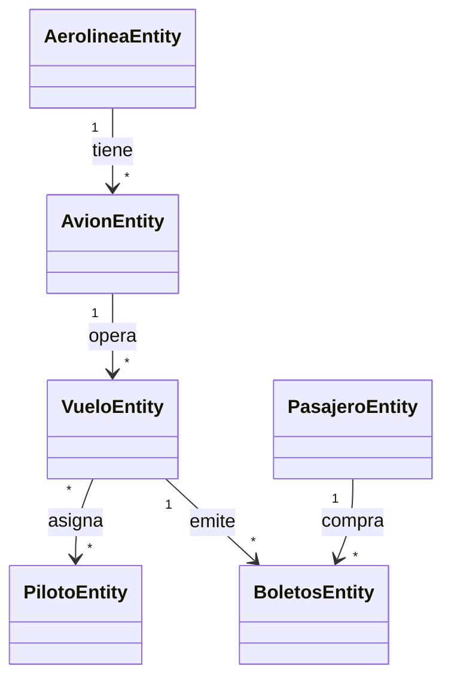

# Aerolinea API

API REST desarrollada con Spring Boot para gestionar una aerolinea: aerolineas, aviones, vuelos, pilotos, pasajeros y boletos.

El proyecto aplica una arquitectura por capas para separar responsabilidades y mantener el codigo ordenado:

```text
Controller -> Service -> Repository -> PostgreSQL
Request/Entity -> Mapper -> Response
```

## Autor

Fabrizio Allcca

## Tecnologias

- Java 17
- Spring Boot 4
- Spring Web MVC
- Spring Data JPA
- Hibernate
- PostgreSQL
- Docker
- Lombok
- MapStruct
- Swagger / Springdoc OpenAPI
- Maven

## Modulos principales

- Aerolineas: registra y consulta aerolineas.
- Aviones: registra aviones, consulta por id, modelo o capacidad, y permite asociarlos a una aerolinea.
- Vuelos: registra vuelos, consulta por id o fecha de salida, y asigna pilotos.
- Pilotos: registra y consulta pilotos.
- Pasajeros: registra pasajeros y permite consultar sus boletos.
- Boletos: registra boletos validando vuelo, pasajero y asiento disponible.

## Reglas de negocio aplicadas

- Un avion pertenece a una aerolinea.
- Un vuelo debe estar asociado a un avion existente.
- La fecha de llegada de un vuelo no puede ser anterior a la fecha de salida.
- Un vuelo puede tener varios pilotos.
- Un boleto debe estar asociado a un vuelo y a un pasajero existente.
- No se puede registrar dos veces el mismo asiento para el mismo vuelo.
- Los endpoints de registro validan campos obligatorios antes de guardar datos.

## Diagrama general



## Base de datos

El proyecto espera una base de datos PostgreSQL con estos valores en `application.properties`:

```properties
spring.datasource.url=jdbc:postgresql://localhost:5432/aerolinea_db
spring.datasource.username=postgres
spring.datasource.password=cero
```

En el entorno local se esta usando Docker con el contenedor `postgres-db`.

## Ejecutar el proyecto

Desde la carpeta raiz del proyecto:

```powershell
.\mvnw.cmd spring-boot:run
```

Luego abrir Swagger:

[http://localhost:8080/swagger-ui/index.html](http://localhost:8080/swagger-ui/index.html)

## Endpoints en Swagger

Swagger agrupa los endpoints por modulo:

- Aerolineas
- Aviones
- Vuelos
- Pilotos
- Pasajeros
- Boletos

## Notas de aprendizaje

Este proyecto trabaja con entidades JPA para representar tablas, repositorios para acceder a la base de datos, servicios para concentrar la logica de negocio, mappers para convertir entidades a respuestas DTO, y controllers para exponer la API REST.

Las pruebas automatizadas no se incluyen por ahora porque todavia no forman parte del avance del modulo.
